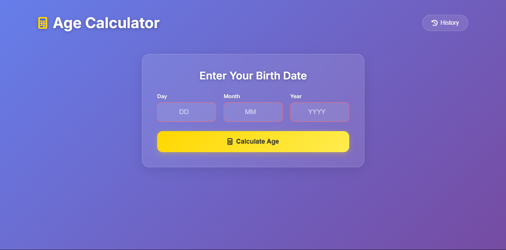
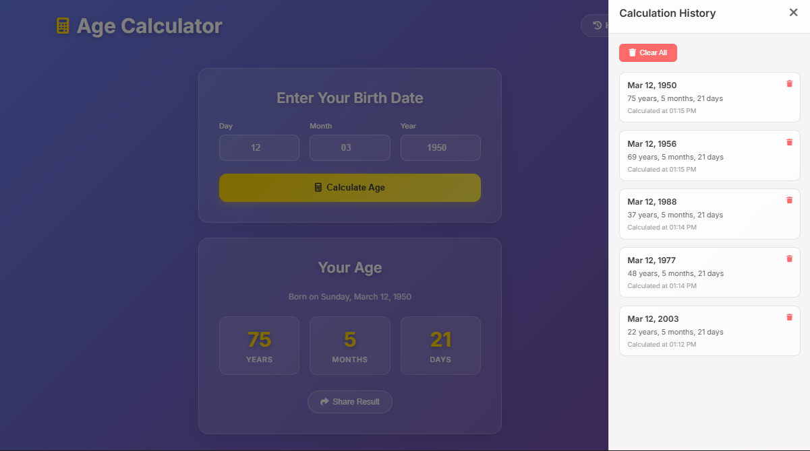

# 🧮 CodeAlpha Age Calculator

This is the **first task** of my **CodeAlpha Web Development Internship – Month 1**.  
The project is a **web-based Age Calculator** that allows users to input their date of birth and instantly calculate their **age in years, months, and days**. 🎯

---

## 📌 Table of Contents

- [📖 Project Overview](#-project-overview)
- [✨ Features](#-features)
- [🛠 Tech Stack](#-tech-stack)
- [🚀 How to Run](#-how-to-run)
- [📚 What I Learned](#-what-i-learned)
- [⬅️ Back to Month-1](#️-back-to-month-1)

---

## 📖 Project Overview

This **Age Calculator Web App** takes a user's date of birth as input and dynamically computes:
- **Years lived**
- **Months lived**
- **Days lived**

The calculation updates instantly upon user input using JavaScript DOM manipulation.

---
## 🖼️ Screenshots / Live Demo

* **Screenshot 1:** 
* **Screenshot 2:** 
* **Live Demo (optional):** [View Live App](https://code-alpha-web-dev-intership-ozdc.vercel.app/)

---
## ✨ Features

- 🖊️ **Simple and clean input form**  
- ⚡ **Instant age calculation (no page reload)**  
- 🎨 **Responsive design for mobile and desktop**  
- 🧮 **Accurate calculation using JavaScript date methods**  

---

## 🛠 Tech Stack

- **HTML** – Structure of the web page  
- **CSS** – Styling for form and layout  
- **JavaScript** – Logic for age calculation and DOM updates  

---

## 🚀 How to Run

1. **Clone the repository or download the folder**  
   ```bash
   git clone https://github.com/TayabGhafor/CodeAlpha_WebDev_Internship.git
``

2. **Navigate to this task folder**

   ```bash
   cd CodeAlpha_WebDev_Internship/Month-1/CodeAlpha_AgeCalculator
   ```
3. **Open `index.html` in your browser**

   * You can simply double-click `index.html`
   * Or use a live server (VS Code extension) for quick preview

---

## 📚 What I Learned

* Working with **HTML forms and inputs**
* Using **JavaScript Date objects** for calculations
* Implementing **DOM manipulation** for instant UI updates
* Structuring a small project with clear and clean code

---

## ⬅️ Back to Month-1

🔗 [Go Back to Month-1 Folder →](../)

---

